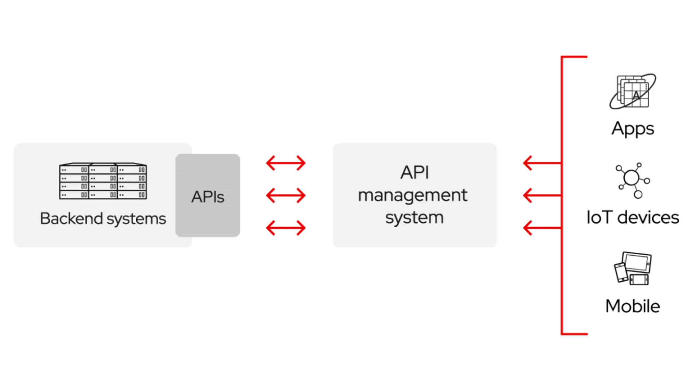

# Introdução

*Application Programming Interface* (API) pode ser definida como um conjunto de regras e definições que permite que um software ou plataforma ofereça serviços e dados de maneira segura e acessível para outros softwares. APIs especificam como os desenvolvedores devem fazer requisições e que tipos de respostas serão recebidas, facilitando assim a integração entre diferentes sistemas.

## Arquitetura de um sistema com API

<p align="center">

</p>
<p align="center">
<i>Fonte: Red Hat</i>
</p>

A imagem acima apresenta uma visão simplificada de como as APIs funcionam como um intermediário entre os sistemas de back-end e o sistema de gerenciamento de APIs:

- **Sistemas de Back-end:** Representam os servidores e bancos de dados que armazenam e processam os dados da aplicação. Eles formam a espinha dorsal da lógica de negócio e operações da aplicação.
- **APIs:** Atuam como a camada de comunicação que permite a interação externa com os sistemas de back-end. Elas definem pontos de acesso (endpoints) onde os serviços são expostos de forma controlada e segura.
- **Sistema de Gerenciamento de API:** Fornece um conjunto de ferramentas para publicar, documentar, e supervisionar as APIs. Isso inclui a autenticação de usuários, análise de tráfego, e implementação de cotas e limites de uso.

As setas duplas entre os componentes indicam que a comunicação é bidirecional. O sistema de gerenciamento de API pode fazer chamadas para os sistemas de back-end para buscar ou modificar dados, enquanto também pode enviar informações de volta para o sistema de gerenciamento, como confirmações de transações ou alertas.

## Tipos de APIs

### 1. API Web

APIs Web são utilizadas para permitir a interação entre aplicações na internet. Dois tipos comuns são:

- **REST (Representational State Transfer):** Usa métodos HTTP de forma clara e eficiente (GET, POST, PUT, DELETE) para operações CRUD (Criar, Ler, Atualizar, Deletar).
- **SOAP (Simple Object Access Protocol):** Um protocolo mais antigo que permite a troca de informações de forma segura e extensiva através de mensagens XML.

### 2. API de Biblioteca

As APIs de bibliotecas permitem que desenvolvedores utilizem funcionalidades específicas em seus programas, como conectar-se a bancos de dados, manipular dados complexos ou realizar operações matemáticas complexas. Um exemplo é a API Pandas em Python para manipulação de dados.

### 3. API de Hardware

APIs de hardware permitem que software interaja diretamente com o hardware, como impressoras, câmeras e sensores. Exemplo: API do Windows para gerenciamento de dispositivos de hardware.

## Exemplos de APIs populares

- [Google Maps API](https://mapsplatform.google.com/): Permite integrar mapas detalhados com localizações em aplicações web ou móveis e realizar consultas geolocalizadas.
- [Twitter API:](https://developer.twitter.com/en/docs/twitter-api) Usada para automação de tweets, obtenção de dados de usuários e mais, ideal para apps que precisam de interação social.
- [Amazon S3 API:](https://docs.aws.amazon.com/AmazonS3/latest/API/Welcome.html) Oferece métodos programáticos para gerenciar dados armazenados no Amazon S3, como upload e download de arquivos.

## Por que usar APIs?

Utilizar APIs em projetos de software tem múltiplos benefícios:

* **Eficiência:** Redução de código necessário e aumento da reutilização de software.
* **Segurança:** Interfaces bem definidas ajudam a proteger os dados e garantir que apenas usuários autorizados tenham acesso.
* **Escalabilidade:** Facilita o manejo de maior número de usuários e dados, permitindo que sistemas cresçam de forma sustentável.

## Uso de APIs em projetos de IA e Ciência de Dados

As APIs oferecem diversos benefícios para projetos de IA e Ciência de Dados, entre eles:
* **Acesso a modelos de IA:** As APIs permitem que os desenvolvedores integrem modelos de IA pré-treinados em seus aplicativos, como modelos de Processamento de Linguagem Natural (NLP) da API GPT-4 da OpenAI ou modelos de visão computacional da API Google Cloud Vision.
* **Aquisição de dados:** As APIs fornecem acesso a grandes conjuntos de dados necessários para treinar modelos de aprendizado de máquina. Isso inclui conjuntos de dados públicos como os oferecidos pelo Kaggle ou dados de plataformas de mídia social como X (antigo Twitter) e Facebook.
* **Serviços alimentados por IA:** Muitas empresas oferecem APIs que permitem aos desenvolvedores integrar recursos de IA em seus aplicativos sem construir eles próprios os modelos. Os exemplos incluem análise de sentimentos, reconhecimento de entidades e tradução de idiomas.

Algumas APIs de IA populares incluem:

* [API OpenAI](https://openai.com/blog/openai-api): oferece acesso a modelos de linguagem poderosos como GPT-4 para tarefas de linguagem natural, como geração, conclusão e resumo de texto.
* [APIs de IA do Google Cloud](https://cloud.google.com/apis): um conjunto de APIs para integrar recursos de visão, linguagem e conversação em aplicativos.
* [API IBM Watson](https://developer.ibm.com/components/watson-apis/): fornece uma variedade de serviços de IA, incluindo PNL, análise de sentimento e visão computacional.

## Como utilizar uma API em Python?

Este módulo ensinará como utilizar APIs em Python através de um exemplo prático: a obtenção de cotações atuais do dólar, euro e bitcoin. Utilizaremos a API da AwesomeAPI, que fornece dados econômicos atualizados.

## Configurando o ambiente

Primeiramente, é necessário ter a biblioteca `requests` instalada, que facilita realizar requisições HTTP. Caso ainda não tenha instalado, você pode fazê-lo via `pip`:

```bash
pip install requests
```

Para a acessar a API da AwesomeAPI não é necessário autenticação. O script [awesome_api.py](../scripts/awesome_api.py) mostra como realizar a consulta das cotações.

```python
# Importando as bibliotecas necessárias
import requests

# Realizando a requisição para a API da AwesomeAPI para obter as últimas cotações
cotacoes = requests.get("https://economia.awesomeapi.com.br/last/USD-BRL,EUR-BRL,BTC-BRL")
cotacoes = cotacoes.json()  # Converte a resposta em JSON

# Processando as cotações recebidas
dolar = str(round(float(cotacoes['USDBRL']['bid']), 2)).replace('.', ',')
euro = str(round(float(cotacoes['EURBRL']['bid']), 2)).replace('.', ',')
bitcoin = cotacoes['BTCBRL']['bid']

# Exibindo as cotações formatadas
print(f"Cotações\nDólar = R$ {dolar}\nEuro = R$ {euro}\nBitcoin = R$ {bitcoin},00")
```

O código acima pode ser explicado através das seguintes partes:
* **Importação dos Módulos:** Os módulos `requests` e `json` são importados para permitir a realização de requisições HTTP e o tratamento dos dados JSON, respectivamente.
* **Requisição HTTP:** A função `requests.get` é utilizada para fazer a requisição à API, especificando quais moedas desejamos consultar.
* **Conversão para JSON:** A resposta obtida é um texto em formato JSON, que é convertido para um objeto Python usando `json()`.
* **Processamento e Formatação dos Dados:** Os dados são extraídos, arredondados e formatados de acordo com as necessidades.
* **Exibição dos Resultados:** As cotações são então exibidas formatadas para fácil leitura.

## Métodos HTTP comuns

Os métodos HTTP são fundamentais para a comunicação na web, indicando a ação desejada para ser realizada para um recurso identificado. Abaixo estão os métodos HTTP mais comuns que podem ser utilizados com a biblioteca `requests`.

### 1. GET

Utilizado para solicitar dados de um servidor. Por exemplo, para obter a lista de usuários de uma API:

```python
response = requests.get('https://api.example.com/users')
users = response.json()
print(users)
```

### 2. POST

Usado para enviar dados para um servidor, como submeter um formulário ou criar um novo recurso. Por exemplo, para criar um novo usuário:

```python
user_data = {'username': 'newuser', 'email': 'user@example.com'}
response = requests.post('https://api.example.com/users', data=user_data)
print(response.status_code)
```

### 3. PUT

Empregado para atualizar dados existentes no servidor. Por exemplo, para atualizar um usuário existente:

```python
updated_data = {'username': 'updateduser', 'email': 'updateduser@example.com'}
response = requests.put('https://api.example.com/users/1', data=updated_data)
print(response.status_code)
```

### 4. PATCH

Usado para aplicar atualizações parciais a um recurso. Por exemplo, para atualizar apenas o e-mail de um usuário sem alterar o resto do conteúdo:

```python
patch_data = {'email': 'updateduser@example.com'}
response = requests.patch('https://api.example.com/users/1', data=patch_data)
print(response.status_code)
```

### 5. DELETE

Usado para remover um recurso especificado do servidor. Por exemplo, para deletar um usuário:

```python
response = requests.delete('https://api.example.com/users/1')
print(response.status_code)
```

**OBS:** O `response.status_code` é um atributo na biblioteca `requests` do Python que contém o código de status HTTP retornado pela resposta do servidor a uma requisição HTTP. Este código de status é um número inteiro que indica o resultado da requisição enviada. Ele é fundamental para entender como o servidor processou a requisição e o que aconteceu como resultado.

O script [http_methods.py](../scripts/http_methods.py) exemplifica o uso dos métodos HTTP GET, POST, PUT, PATCH e DELETE usando a API do [JSONPlaceholder](https://jsonplaceholder.typicode.com/), que é uma API de teste gratuita que simula comportamentos de uma aplicação real com dados de placeholder.

## Códigos de resposta HTTP

Ao fazer requisições HTTP, o servidor responde com códigos de estado HTTP que indicam se a requisição foi bem-sucedida, e se não, qual foi o problema. A tabela a seguir mostra alguns dos códigos mais comuns e seus respectivos significados.

|Código|Significado|
|-|-|
|200 OK|Indica que a requisição foi bem-sucedida e o servidor forneceu o recurso solicitado.|
|404 Not Found|Indica que o recurso solicitado não foi encontrado no servidor.|
|400 Bad Request|Indica que a requisição feita pelo cliente está incorreta ou malformada, e o servidor não pode entendê-la.|
|401 Unauthorized|Indica que a requisição requer autenticação do usuário, e ele não está autenticado.|
|500 Internal Server Error|Indica que o servidor encontrou uma condição inesperada que impediu de atender à solicitação.|

## Trabalhando com arquivos JSON

JSON (*JavaScript Object Notation*) é um formato leve de intercâmbio de dados, fácil de ler e escrever para humanos, e fácil de analisar e gerar para máquinas. É comumente usado para transmitir dados em aplicações web entre clientes e servidores. A biblioteca `json` é utilizada para manipular arquivos JSON em Python.

JSON é um formato de dados que usa texto simples em uma estrutura organizada de pares de chave-valor (semelhantes aos dicionários em Python) e listas ordenadas (semelhantes às listas em Python). Por exemplo:

```json
{
  "nome": "João",
  "idade": 30,
  "cidade": "Rio de Janeiro",
  "filhos": ["Ana", "Luiz"]
}
```

### Lendo JSON em Python

Com a biblioteca `json` você pode analisar strings JSON e convertê-las em dicionários Python. Aqui está um exemplo de como ler uma string JSON:

```python
import json

data_json = '{"nome": "João", "idade": 30, "cidade": "Rio de Janeiro", "filhos": ["Ana", "Luiz"]}'
data_python = json.loads(data_json)

print(data_python)
print("Nome:", data_python['nome'])
```

### Escrevendo JSON em Python

Você também pode converter um dicionário Python de volta para uma string JSON usando a biblioteca `json`. Isso é útil para enviar dados para uma API, por exemplo:

```python
import json

data_python = {
  "nome": "João",
  "idade": 30,
  "cidade": "Rio de Janeiro",
  "filhos": ["Ana", "Luiz"]
}

data_json = json.dumps(data_python, indent=4)
print(data_json)
```

Em resumo, as principais funções da biblioteca `json` são:
* `json.dumps()`: Converte um objeto Python (como dicionários e listas) em uma string JSON.
* `json.loads()`: Converte uma string JSON em um objeto Python.

## Usando uma API com Parâmetros de Consulta

Ao trabalhar com APIs, muitas vezes precisamos enviar informações adicionais para especificar ou filtrar o tipo de dados que queremos receber. Essas informações são passadas como parâmetros de consulta na URL da requisição. Neste módulo, aprenderemos como usar parâmetros de consulta em requisições HTTP com a biblioteca `requests` em Python.

Parâmetros de consulta são pares de chave-valor que são adicionados à URL de uma requisição HTTP para especificar informações adicionais para essa requisição. Eles são geralmente usados para filtragem, paginação ou precisão de dados em APIs. Uma URL com parâmetros de consulta pode parecer assim:

https://api.exemplo.com/dados?chave1=valor1&chave2=valor2

Vamos usar a API do [OpenWeatherMap](https://openweathermap.org/api) como exemplo, que permite buscar dados meteorológicos passando a cidade e a chave de API como parâmetros de consulta. Primeiramente, é necessário registrar-se na plataforma para obter uma chave de API. 

A importação da chave de forma segura (variável de ambiente) é realizada através da biblioteca `python-dotenv`. A chave obtida deve ser salva em um arquivo `.env`.

```python
API_KEY = "insira a sua chave aqui"
```

### Exemplo prático

O script [openweather_api.py](../scripts/openweather_api.py) mostra um exemplo prático de como fazer uma requisição com parâmetros de consulta usando a biblioteca `requests`:

```python
# Importando as bibliotecas necessárias
import requests
import os
from dotenv import load_dotenv

# Carregando as variáveis de ambiente do arquivo .env
load_dotenv()

# Obtendo a chave da API que foi salva como variável de ambiente
API_KEY = os.getenv('API_KEY')

# URL base da API
url = 'https://api.openweathermap.org/data/2.5/weather'

# Configurando os parâmetros de consulta
params = {
    'q': 'Goiânia',
    'appid': API_KEY,
    'units': 'metric',
    'lang': 'pt_br'
}

# Fazendo a requisição GET com parâmetros de consulta
response = requests.get(url, params=params)
data = response.json()

# Retornando a resposta
print(data)
```

## Criando a sua API com Flask

Flask é um micro-framework para Python baseado em Werkzeug e Jinja2. É classificado como "micro" porque não requer ferramentas ou bibliotecas particulares. Isso não significa que suas funcionalidades são limitadas; pelo contrário, Flask é extremamente flexível e permite o desenvolvimento de aplicações robustas com extensões disponíveis para adicionar funcionalidades conforme necessário.

## Por Que Usar Flask?

* **Simplicidade:** Flask é fácil de usar e aprender, perfeito para começar rapidamente com o desenvolvimento web.
* **Flexibilidade:** Permite usar a estrutura desejada para o projeto, não impondo dependências ou layout de projeto.
* **Documentação ampla e comunidade ativa:** Flask possui uma excelente documentação e uma comunidade muito ativa, facilitando o suporte e a expansão de seus conhecimentos.

## Configurando o ambiente

Primeiramente, é necessário realizar a instalação das bibliotecas `python-dotenv`, `Flask` e `openai`. Você pode fazer isso via `pip` com:

```bash
pip install python-dotenv Flask openai
```

Após a instalação, é necessário criar um arquivo `.env` e inserir a chave de acesso dentro dele.

```python
OPENAI_API_TOKEN = "insira a sua chave aqui"
```

**OBS:** Caso o código desenvolvido seja disponibilizado em um repositório público, garanta que a chave de acesso não fique visível. Uma maneira de garantir isso é adicionar uma referência ao arquivo `.env` no `.gitignore` do projeto.

## Criando a API

O script [api_flask.py](../scripts/api_flask.py) mostra como criar uma API simples que possa receber solicitações de um usuário, consumir a própria API da OpenAI e responder com o conteúdo gerado. O trecho a seguir mostra como foi configurado o endpoint para geração de conteúdo.

```python
# Configurando o endpoint para geração de conteúdo via API da OpenAI
@app.route('/generate', methods=['POST'])
def generate_content():
    data = request.json
    try:
        response = client.chat.completions.create(
            model=GPT_MODEL,
            messages=[
                {"role": "system", "content": data.get("sys_prompt")},
                {"role": "user", "content": data.get("user_prompt")}
            ],
            max_tokens=data.get("max_tokens", 250),
            temperature=data.get("temperature", 0.5),
            seed=data.get("seed")
        )
        return jsonify({"response": response.choices[0].message.content}), 200
    except Exception as e:
        return jsonify({"error": str(e)}), 500
```

Ao executar o script, a API estará disponível em http://localhost:5000/generate e poderá receber requisições do tipo POST contendo um JSON com os campos `sys_prompt`, `user_prompt`, `max_tokens`, `temperature` e `seed`.

## Testando a API

Para testar a API criada, você pode utilizar ferramentas como **cURL** ou **Postman**. Garanta que o script da API ainda esteja rodando localmente para que os testes funcionem corretamente.

### Usando o cURL no terminal

[cURL](https://curl.se/) é uma ferramenta de linha de comando usada para transferir dados com URLs. É uma maneira rápida de testar sua API diretamente do terminal. Aqui está um exemplo de como você poderia fazer uma requisição POST para a sua API usando cURL:

```bash
curl -X POST http://localhost:5000/generate \
     -H "Content-Type: application/json" \
     -d '{"sys_prompt": "Você é um historiador especialista em História do Brasil.", "user_prompt": "Quando começou o ciclo do ouro?", "max_tokens": 100, "temperature": 0.1, "seed": 123}'
```

### Usando Postman

[Postman](https://www.postman.com/) é uma ferramenta popular para testar APIs que fornece uma interface gráfica de usuário para fazer solicitações HTTP. Para usar o Postman para testar sua API Flask:
1. Abra o Postman.
2. Configure uma nova solicitação selecionando "POST" como o método e inserindo a URL da sua API (http://localhost:5000/generate).
3. Vá para a aba "Body", selecione "raw" e escolha "JSON" como formato.
4. Insira o corpo da requisição JSON, por exemplo:

```json
{
  "sys_prompt": "Você é um historiador especialista em História do Brasil.",
  "user_prompt": "Quando começou o ciclo do ouro?",
  "max_tokens": 100,
  "temperature": 0.1,
  "seed": 123
}
```

5. Clique em "Send" para enviar a solicitação.
6. Caso a requisição tenha sucesso, a resposta irá aparecer na aba Body de saída e deve ser similar a seguinte:

```json
{
    "response": "O ciclo do ouro no Brasil teve início no final do século XVII, por volta de 1690, com a descoberta de grandes jazidas de ouro na região de Minas Gerais. A exploração do ouro se intensificou ao longo do século XVIII, tornando-se uma das principais atividades econômicas do Brasil Colônia."
}
```